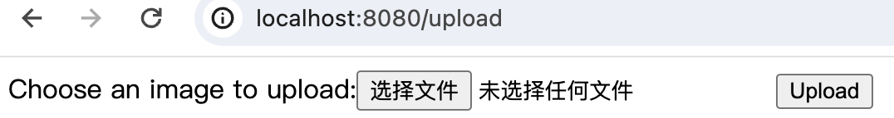
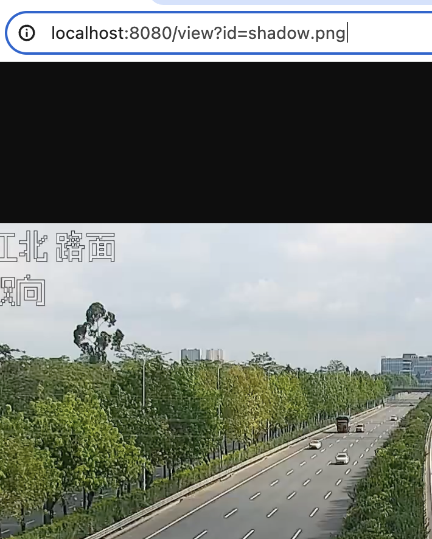
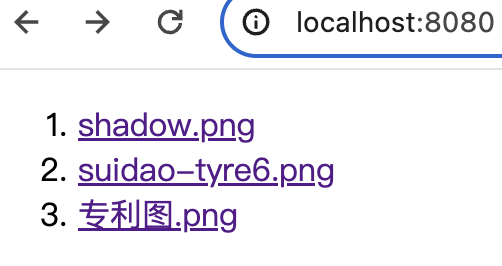

## mac pro安装golang和vscode配置
1. 下载[Golang](https://go.dev/dl/)的pkg版本，默认安装在/usr/local目录下。该目录是隐藏目录 可以在finder中使用cmd+shift+g调出go菜单直接输入目录进入。
2. 配置环境变量
```go
vim ~/.bash_profile
# 在文件末尾加入：export PATH=$PATH:/usr/local/go/bin
source ~/.bash_profile
```
3.配置vscode环境：
* 设置go的项目目录：
  * 设置gopath：go的工作目录，在这个目录进行编译、链接最后生成所需要的库、可执行文件。
    ```
    go env -w GOPATH=yourpath
    ```
  * 设置goMod状态:
    ```
    go env -w GO111MODULE=on
    go env -w GOPROXY=https://goproxy.cn,direct
    ```
* 在vscode中打开yourpath，即可在终端运行程序：go run example.go。
 * 安装
 一键运行代码工具Code Runner；
 自动补全工具，shift+cmd+p,选择Go：INstall/Update Tools后全选下载。
 * 设置vscode，打开setting.json,点击扩展下的Go目录，在settings.json中加入
    ```
    "go.inferGopath": true,
    "go.useCodeSnippetsOnFunctionSuggest": true,
    ```
## 图片上传项目
基于Golang，实现图片上传、查看功能的服务器
## 演示
进入src目录，运行：go run photoweb.go
1. 访问：localhost:8080/upload,出现上传表单


2. 访问：localhost:8080/view?filename,上传成功后进行图片展示


3. 访问：localhost:8080/,列出所有图片，点击任意图片名可访问图片内容如2

## bug 
1. :=只能在函数内部使用,全局变量声明需要使用var
